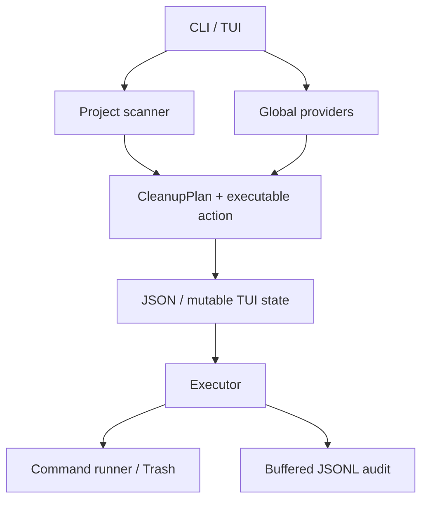
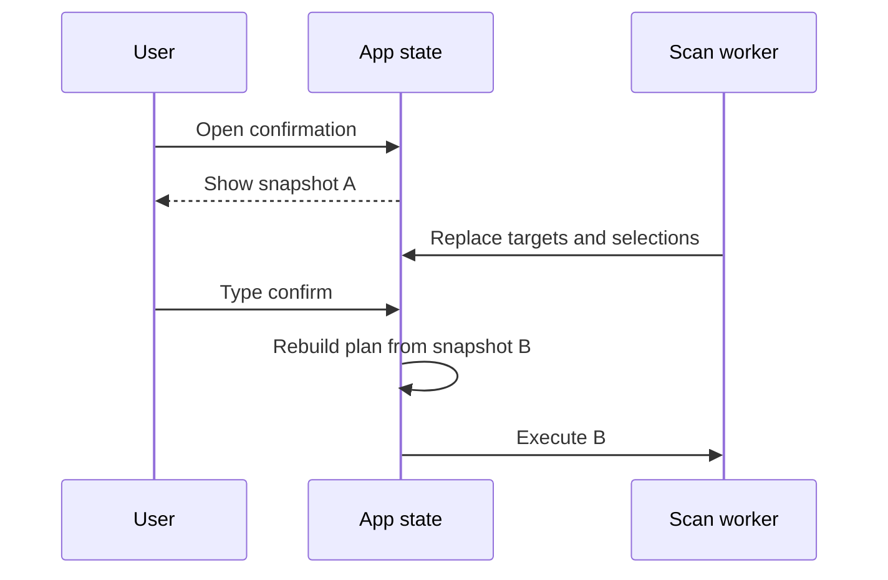
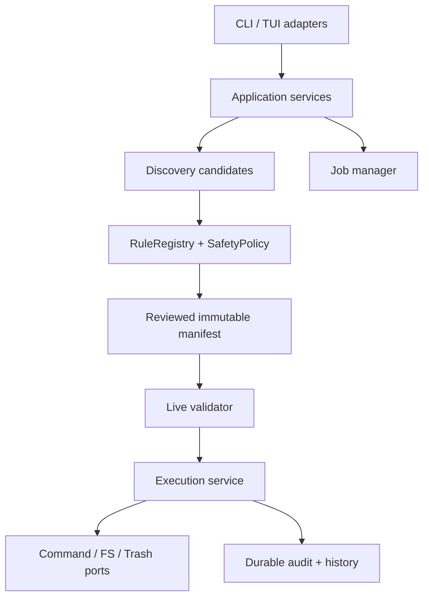
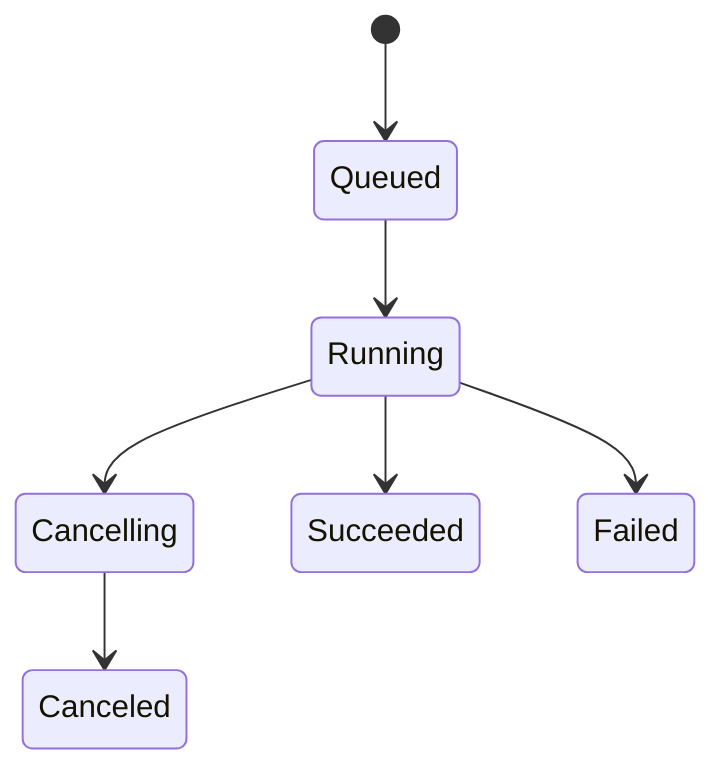

# DevSweep 极度详细代码、稳定性、规则与架构审计

> 审计日期：2026-07-27  
> 审计对象：[`bahayonghang/devsweep`](https://github.com/bahayonghang/devsweep)  
> 固定基线：`02e09254ab3ada9df562b9ca0ba586e6df6af2a8`  
> 对标对象：[`tw93/Mole`](https://github.com/tw93/Mole)  
> Mole 固定基线：`27123a964aa671d2e64222634d29d4bd2dc866ed`，代码内版本 `1.48.1`

---

## 0. 执行摘要

### 0.1 最终判断

**结论：DevSweep 的“扫描器 / dry-run 预览器”已经形成可用 MVP；当前 `--execute` 与 TUI 实际清理路径不适合以稳定版公开发布。**

建议发布判断：

| 范围 | 判断 | 原因 |
|---|---|---|
| `scan`、规则展示、只读 TUI | **Conditional Go** | 有基础分层、默认 dry-run、路径证据和两平台 CI；仍需修复部分扫描、长列表和诊断问题 |
| CLI `clean --execute` | **No-Go** | 外部 plan 未验证、缺少实时路径重验证、命令无超时、audit 不能保证副作用后持久化 |
| TUI cleanup | **No-Go** | 除上述问题外，还有伪取消、确认对象漂移、并发 mutation job |
| 对外宣称“safety-first stable” | **No-Go** | 当前安全模型主要存在于数据字段和 UI 文案，最终执行漏斗尚未闭合 |

本报告采用严格但不夸大的严重度口径：

- **P0**：无需额外高摩擦前提、在支持的常规流程中即可造成灾难性损失或远程代码执行。
- **P1**：发布阻断；需要显式执行、竞态或异常条件，但一旦发生可能误删、继续清理或失去审计。
- **P2**：近期必须修复的可靠性、正确性、安全纵深或架构债。
- **P3**：后续维护性、可用性和仓库卫生改进。

按这个口径，本次确认：

| 严重度 | 数量 | 说明 |
|---|---:|---|
| P0 | 0 | 当前没有网络计划下载、远程控制或默认执行路径；不要因此误解为“可以发布执行功能” |
| P1 | 10 | 均应在稳定版开放清理前关闭 |
| P2 | 14 | 影响可信度、三平台正确性、性能、规则精度和长期演进 |
| P3 | 5 | 不阻断 MVP，但会持续制造误解、维护成本或低质量体验 |

若未来支持“下载、分享、同步或自动生成 cleanup plan”，F-01 应从 P1 **立即升级为 P0**。

### 0.2 成熟度评分

评分是相对“公开分发的安全优先清理器”，不是相对普通学习项目。

| 维度 | 评分 | 评价 |
|---|---:|---|
| 产品定位与文档 | 6.0 / 10 | Windows-first、开发者清理、dry-run、计划和审计方向清楚 |
| 代码结构 | 5.0 / 10 | 模块无循环，scanner 不直接删除；领域对象与应用编排仍混合 |
| 执行安全 | 3.0 / 10 | 永久删除禁用是优点，但 plan、live validation、取消和审计边界未闭合 |
| 稳定性 | 4.0 / 10 | 单 action 失败可继续；命令、扫描、size 均无统一预算和真实取消 |
| 规则正确性 | 4.0 / 10 | marker-first 基础合理；全局目录、工具配置和命令实际作用域不够精确 |
| 测试可信度 | 5.0 / 10 | 77 个单元测试和两平台绿色 CI；关键 destructive behavior 没有集成证明 |
| 发布与供应链 | 3.0 / 10 | 有 Cargo.lock 和基本 CI；无许可证、release pipeline、签名、SBOM、安全 gate |
| **综合** | **4.4 / 10** | **结构成形的早期 MVP，不是执行安全已经完成的稳定清理器** |

### 0.3 最需要先修的 8 件事

1. 将 plan 从“可执行命令包”改成“声明式意图”，执行时由受信任 registry 重建动作。
2. 让确认框持有不可变 `ExecutionManifest`，而不是按 Enter 时从可变 TUI state 重算。
3. 在真实取消完成前移除“Canceled”承诺；随后把 cancellation token 贯穿 scanner、size、provider、executor。
4. 建立唯一、不可绕过的 `SafetyPolicy::authorize()`，执行前重检路径、身份、root containment、link/reparse、whitelist 和活跃状态。
5. 对 Cargo 使用 `cargo metadata` 解析真实 `target_directory`，确保展示、size、guard 和清理命令指向同一对象。
6. 为所有外部命令提供 timeout、输出上限、进程树终止和稳定的 typed diagnostics。
7. mutation job single-flight；修复 exact duplicate / overlapping roots，禁止同一 footprint 重复执行。
8. 将 audit 改成 action 前后 durable journal，记录真实 action path/cwd、plan digest、run ID 和序号。

### 0.4 已经做对、应保留的部分

- CLI cleanup 默认 dry-run；实际执行要求显式 `--execute` 和 plan：`src/main.rs:56-84`。
- scanner/model 只生成计划，没有直接调用删除：`src/scanner.rs:1-16,113-216`。
- command 使用 `program + args`，没有把字符串交给 shell：`src/executor.rs:89-99`。
- permanent delete 在当前 build 中硬拒绝，即使传入 flag：`src/executor.rs:284-285,709-743`。
- 项目扫描使用 `symlink_metadata`，并跳过 symlink / Windows reparse point：`src/scanner.rs:44-53,100-106`、`src/fs_size.rs:37-67`。
- Cargo home 是 inspect-only，不会直接清理：`src/providers.rs:243-274`。
- 普通 target 失败不会自动中止所有后续 target：`src/executor.rs:205-246,590-706`。
- `Cargo.lock` 已提交；固定 HEAD 的 Windows、Ubuntu CI 均成功。

这些优点说明不需要推倒重写。真正需要重写的是**执行授权边界和 job runtime**。

---

## 1. 审计范围、方法与限制

### 1.1 审计方法

本次工作包括：

1. 通过 GitHub 当前仓库元数据、分支、提交和 Actions 状态固定审计快照。
2. 完整克隆并逐文件审阅 DevSweep；重点覆盖：
   - `src/main.rs`
   - `src/cli.rs`
   - `src/model.rs`
   - `src/scanner.rs`
   - `src/providers.rs`
   - `src/rules.rs`
   - `src/ranking.rs`
   - `src/fs_size.rs`
   - `src/path_safety.rs`
   - `src/executor.rs`
   - `src/tui.rs`
   - CI、release recipe、README、design 和 Trellis 规范
3. 固定当前 Mole 提交，审阅其删除漏斗、路径保护、白名单、超时、purge、installer plan、history、CI 和 release。
4. 对 Cargo cleanup 作用域使用 Rust 官方文档交叉验证。
5. 对 11 个直接依赖的精确 lock 版本做 GitHub Advisory Database spot-check。
6. 静态统计规模、测试、依赖、提交和仓库组成。

### 1.2 可复核基线

| 项目 | 值 |
|---|---|
| DevSweep HEAD | `02e09254ab3ada9df562b9ca0ba586e6df6af2a8` |
| DevSweep 提交日期 | 2026-07-01 |
| DevSweep 历史 | 88 commits；首个提交 2026-06-09 |
| DevSweep tag / release | 无 tag；GitHub 无 release |
| Mole HEAD | `27123a964aa671d2e64222634d29d4bd2dc866ed` |
| Mole HEAD 日期 | 2026-07-27 |
| Mole 版本 | `Mole/mole:57`，`1.48.1` |

### 1.3 动态验证状态

本地容器没有 `cargo`、`rustc` 和 `just`，因此下列本地动态门禁**没有执行成功**：

- `just ci`
- `cargo fmt --all -- --check`
- `cargo check --all-targets`
- `cargo test --all-targets`
- `cargo clippy --all-targets -- -D warnings`
- `cargo audit`
- `cargo deny`

这不是代码失败，而是审计环境的验证阻断。

作为补充，GitHub Actions 在**完全相同的 DevSweep HEAD** 上有两个成功 job：

- [Ubuntu CI job](https://github.com/bahayonghang/devsweep/actions/runs/28527871208/job/84569162364)
- [Windows CI job](https://github.com/bahayonghang/devsweep/actions/runs/28527871208/job/84569162355)

两者都完成了 fmt/check/test/clippy，但 `actions/checkout@v4` 当时产生了 Node.js 20 deprecated、被强制使用 Node 24 的 warning。绿色 CI 证明该提交在这两个 runner 上可编译并通过现有测试，**不能证明本报告中的安全竞态、真实 Trash、超时和 TOCTOU 已被覆盖**。

### 1.4 仍未验证

- Windows junction、UNC、长路径、跨卷 Trash、文件占用和 ACL。
- macOS Trash、Apple Silicon 和 macOS-specific cache path。
- Linux freedesktop Trash、mount/bind mount。
- 真实 package-manager 卡死、超大输出、孙进程终止。
- 巨型目录、深树、hardlink、sparse file 的性能与实际可释放空间。
- 完整 transitive RustSec/advisory/license 扫描。
- 恶意终端控制字符在各 ratatui/crossterm backend 上的实际效果。

凡依赖这些运行时行为的结论，在本报告中均标注为“需动态验证”或降低信心。

---

## 2. 仓库画像

### 2.1 规模

| 指标 | 当前值 |
|---|---:|
| Rust 文件 | 13 |
| Rust 总行数 | 7,799 |
| 估算生产区 | 4,933 |
| 估算测试区与 helper | 2,866 |
| `#[test]` | 77 |
| 最大文件 | `src/tui.rs`，3,834 行 |
| `tui.rs` 生产区 | 2,725 行，占全部估算生产代码约 55.2% |
| `src/executor.rs` | 1,011 行 |
| `src/providers.rs` | 848 行 |
| runtime direct deps | 10 |
| dev direct deps | 1 |
| Cargo.lock package records | 259 |
| Cargo.lock unique package names | 245 |
| production `unsafe` block | 0 |

### 2.2 仓库卫生

仓库有 191 个 tracked files，其中 168 个位于 `.trellis/`；`.trellis` 约 1.2 MB，而 `src` 约 276 KB。

这不是运行时问题，但带来三个维护信号：

1. code review diff 容易被流程元数据淹没；
2. GitHub 语言/规模感知和新贡献者导航被干扰；
3. specification 与代码可能独立漂移——本次已经发现 nested error、cancel、配置等设计要求没有落地。

建议把必须版本化的 Trellis 规范与临时 journal/archive 分开，或用独立分支/文档仓库承载高频生成内容。

### 2.3 依赖 spot-check

对 lock 中 11 个直接依赖版本（含 `tempfile`）查询 GitHub Advisory Database：

`anyhow 1.0.102`、`clap 4.6.1`、`crossterm 0.29.0`、`ratatui 0.30.1`、`rayon 1.12.0`、`serde 1.0.228`、`serde_json 1.0.150`、`trash 5.2.6`、`tracing 0.1.44`、`tracing-subscriber 0.3.23`、`tempfile 3.27.0`。

在 2026-07-27 的精确版本 spot-check 中没有匹配 advisory。这个结果**不等于依赖树零漏洞**，因为：

- 没有运行完整 transitive `cargo audit`；
- 没有 `cargo deny` license/source/duplicate policy；
- 不同 OS 实际启用的 target-specific dependency 不同；
- advisory database 会持续变化。

---

## 3. 当前架构与真实信任边界

### 3.1 当前数据流



基础方向没有循环依赖，低层 model 也没有依赖 UI。但 `CleanupPlan` 混合了四种不同信任级别：

1. discovery snapshot；
2. scanner 的默认推荐；
3. 用户选择；
4. executor 的最终授权。

这正是大多数高风险缺陷的共同根因。

### 3.2 当前关键边界

| 输入/边界 | 当前信任方式 | 缺失控制 |
|---|---|---|
| plan JSON | serde 能解析即可信 | version、schema、来源、TTL、digest、action allowlist、不变量 |
| filesystem snapshot | scan 时的 path/mtime/size | execute 前 identity、link/reparse、root containment、marker/config 重检 |
| PATH 中工具 | 找到文件即可 | executable identity、neutral cwd、timeout、输出上限、重探测 |
| provider stdout | 第一条非空行 | absolute/existing/type/provenance/parser |
| TUI worker events | job id 部分过滤 | generation、合法状态迁移、immutable confirmation、single-flight |
| audit path | 普通 append file | no-follow、私有权限、锁、durability、真实 action authority |

### 3.3 威胁与故障模型

当前没有网络下载或 daemon，因此主要不是互联网攻击，而是本地可信度问题：

- 用户执行旧 plan、手工编辑 plan 或执行来源不明 plan；
- 计划生成后目标被 rename/recreate；
- symlink/junction/reparse 在 scan 与 execute 之间变化；
- project-local config 改变 package-manager 的“global”路径；
- PATH shim 挂死、输出无限、退出异常；
- 用户取消或退出后仍继续清理；
- 两个 clean job 同时运行；
- audit 盘满、权限变化或并发损坏；
- 大型/不可读/网络目录使扫描挂住或产生错误总计。

---

## 4. P1 发布阻断问题

### F-01 — 外部 plan 是未验证的命令与 Trash capability

| 字段 | 内容 |
|---|---|
| 严重度 | **P1；若支持计划分享/下载则 P0** |
| 性质 | 客观安全边界缺陷 |
| 信心 | 高 |
| 证据 | `src/main.rs:61-77`；`src/model.rs:7-10,36-50,89-106`；`src/executor.rs:171-175,252-285` |

`CleanupPlan`、`CleanTarget` 和 `CleanAction` 可直接反序列化；`Command` 允许 plan 自由提供 `program`、`args`、`cwd`，`MoveToTrash` 允许自由提供路径。CLI 只做 JSON syntax decode，然后直接进入 executor。

更严重的是：

- guard 检查 `CleanTarget.path`：`src/executor.rs:257`；
- 真正 Trash 使用 `CleanAction::MoveToTrash.path`：`src/executor.rs:280-282`；
- 两个字段可以不一致；
- `risk`、`reversible`、`evidence`、`scope` 和 `rule_id` 都不参与授权；
- `version` 只被输出，从未被执行路径检查。

**最强合理反驳**：用户必须显式提供 `--plan` 和 `--execute`；argv 未经过 shell，所以没有 shell injection。

**结论**：这能证明“不是无交互远程执行”，不能证明 plan 是安全计划。一个被替换或下载的 JSON 仍可运行任意本地程序，或者展示 A、移动 B。README 将其称为 auditable cleanup plan，而不是脚本。

**建议实现**：

```rust
enum PlannedIntent {
    TrashProjectArtifact { rule_id: RuleId, target_id: TargetId },
    RunBuiltInAction { provider_id: ProviderId, action_id: ActionId },
}
```

- JSON 只保存 intent 和事实证据，不保存任意 program/argv。
- 执行时由当前受信任 `ActionRegistry` 重建 argv。
- `UntrustedPlan -> ValidatedPlan` 是强制类型转换，executor 不能接受未验证 DTO。
- exact version dispatch；未知字段采用明确 compatibility policy。
- 校验重复 ID/path、scope containment、Noop selection、risk/action/reversible 一致性。

**验收**：

- 恶意 plan 中加入 `cmd.exe`、PowerShell、`/bin/sh` 或额外 arg，runner 调用次数为 0。
- `target.path=A`、`action.path=B` 在第一个副作用前失败。
- version 0/2、相对路径、未知 action、重复 ID/path 均 fail closed。

**预计工作量**：4–7 工程日。

---

### F-02 — 确认框展示的对象可能不是最终执行对象

| 字段 | 内容 |
|---|---|
| 严重度 | **P1** |
| 性质 | 客观确认竞态 |
| 信心 | 高 |
| 证据 | `src/tui.rs:501-513,568-576,712-717,932-981` |

打开确认框时，`ConfirmState` 只保存 count、字符串摘要和 command preview。后台 staged/final scan 仍可替换 `self.targets` 和 `selected_ids`。用户按 Enter 时又调用 `selected_cleanup_plan()`，从**当前可变状态**重建计划。

事件链：



这违反了清理确认最重要的不变量：**what you see is what will execute**。

**最强合理反驳**：新增的 global target 默认通常未选中，所以实际误删概率不高。

**结论**：概率不能修复对象身份。staged scan 还会重置用户 selection，已经存在扩大集合的路径。

**修复**：

- `ConfirmState` 持有不可变 `ExecutionManifest` 和 digest。
- Enter 只消费该 manifest。
- 确认期间 scan 更新要么延迟应用，要么使 modal 失效并要求重新确认。
- confirmation 文案显示 manifest hash 前 8–12 位，audit 记录完整 digest。

**验收**：`open confirm -> ScanProgress/ScanFinished -> Enter` 后，runner 的 target IDs 与打开 modal 时完全一致；或 Enter 被拒绝并要求重新确认。

**预计工作量**：1–2 日。

---

### F-03 — TUI Cancel 是伪取消；退出也不治理 worker / child 生命周期

| 字段 | 内容 |
|---|---|
| 严重度 | **P1** |
| 性质 | 客观安全与稳定性缺陷 |
| 信心 | 高 |
| 证据 | `src/tui.rs:101-111,118-230,631-642,783-797`；`src/executor.rs:205-246` |

`Effect::CancelJob` 只向 UI channel 发送 `WorkerEvent::JobCanceled`。没有 token、control channel、JoinHandle 或 child handle。UI 立即显示 Canceled，但 worker 和已启动命令继续执行。

后续 progress 还会调用 `mark_job(...Running...)`，最终 finish 又可把 Canceled 覆盖为 Succeeded/Failed：`src/tui.rs:519-619,662-670`。

**最强合理反驳**：中断 Trash 或 package-manager 命令并不总是安全；cancel 可能只是取消 UI 等待。

**结论**：若不能安全取消，就不应该显示“Canceled”。对 destructive tool，错误的取消承诺比没有取消按钮更危险。

**短期止血**：

- 暂时移除 `x cancel`，或明确显示“当前 action 不可取消；将在 action 边界停止”。
- `q`/Ctrl-C 在 mutation job 运行时要求用户选择“继续等待”或“请求边界取消”，不能直接假定 worker 停止。

**长期修复**：

- `Running -> Cancelling -> Canceled`，worker 确认停止后才进入终态。
- token 贯穿 scan、size、provider 和 executor。
- 每个 target 前后检查 token。
- Unix 进程组、Windows Job Object 终止子进程树。
- 不能安全中断的 action 显示 `cancel_pending`。

**验收**：第 N 个 fake action 阻塞时取消，确认停止后 N+1 runner 调用次数为 0；迟到事件不能改变终态。

**预计工作量**：3–5 日。

---

### F-04 — 没有中央安全漏斗和执行前 live revalidation

| 字段 | 内容 |
|---|---|
| 严重度 | **P1** |
| 性质 | 客观安全缺口 |
| 信心 | 高 |
| 证据 | `src/path_safety.rs:3-43`；`src/scanner.rs:50-53,101-106,322-325`；`src/executor.rs:252-290` |

当前唯一执行期路径策略是“不删除包含当前 devsweep 可执行文件的 target”。它没有：

- filesystem root / home / profile / repo root / `.git` 等 protected roots；
- persistent whitelist；
- target 必须位于授权 scan root；
- target/action path 同一性；
- link/reparse ancestor 检查；
- stable object identity；
- marker/config/activity recheck；
- plan TTL；
- audit path 与 target 的冲突检查。

scanner 阶段跳过 symlink/reparse 是正确基础，但不能防止 scan 后 rename/recreate 或 junction replacement。

`current_exe()` 失败时 guard 返回 false：`src/path_safety.rs:7-9`。作为唯一 safety guard，这是 fail-open。

**最强合理反驳**：项目 target 大多使用 Trash，可恢复；命令动作依赖官方工具自行限制。

**结论**：可恢复不是授权；Trash 可能被清空、跨卷失败或移动用户未预期对象。官方命令的真实配置边界也可能与展示路径不同。

**目标**：所有 side effect 必须经过唯一入口：

```rust
SafetyPolicy::authorize(
    &validated_action,
    &live_filesystem_state,
    &user_policy,
) -> Result<AuthorizedAction, Denial>
```

默认保护至少包含：

- filesystem/volume roots；
- user profile/home 整体；
- Desktop/Documents/Downloads；
- scan root / repository root / `.git`；
- credentials、package-manager config、IDE settings、AI 会话和账户状态；
- 当前 executable 和 audit path；
- 用户 whitelist。

**验收**：path replacement、ancestor junction、root escape、marker disappearance、whitelist、current-exe lookup failure 均在副作用前拒绝。

**预计工作量**：5–8 日。

---

### F-05 — Rust target 展示范围与 `cargo clean` 真实作用域可能不同

| 字段 | 内容 |
|---|---|
| 严重度 | **P1** |
| 性质 | 客观 correctness / destructive-scope 缺陷 |
| 信心 | 高 |
| 证据 | `src/scanner.rs:113-156` |

scanner 只检查 `<dir>/target`，按这个路径估算 size 并展示；动作却是：

```text
cargo clean --manifest-path <dir>/Cargo.toml
```

Cargo 官方文档明确说明：

- 不带选项的 `cargo clean` 删除整个 target directory；
- target directory 可以通过 `--target-dir`、`CARGO_TARGET_DIR` 或 `build.target-dir` 配置；
- workspace 默认也可能共享 target directory。

参考：[cargo clean - The Cargo Book](https://doc.rust-lang.org/cargo/commands/cargo-clean.html)。

因此确认页展示 A 的大小和路径，命令可能清理 B 或共享 target directory。当前 guard 同样只看 A。

**最强合理反驳**：大部分项目使用默认 local `target/`；Cargo 官方命令比直接删目录更懂 workspace。

**结论**：正因为 official command 可能扩大到 workspace/shared target，必须解析并展示实际作用域，不能把 local `target/` 当授权证据。

**修复**：

1. `cargo metadata --format-version 1 --no-deps` 获取 `workspace_root` 与 `target_directory`。
2. 显示并估算真实 target directory。
3. action 显式绑定 `--target-dir <resolved>`。
4. 先运行 `cargo clean --dry-run --verbose` 形成预览证据。
5. execute 前重新解析；路径变化则要求 rescan/reconfirm。
6. 无法解析 metadata 时降级为 Trash local target 或 inspect-only，不能静默运行范围未知的命令。

**验收**：custom target-dir、workspace shared target、`CARGO_TARGET_DIR` 三组 fixture 中，display path、size path、guard path 和 actual action scope 完全一致。

**预计工作量**：2–4 日。

---

### F-06 — 外部命令无 timeout、无输出上限、无进程树治理

| 字段 | 内容 |
|---|---|
| 严重度 | **P1** |
| 性质 | 客观稳定性缺陷 |
| 信心 | 高 |
| 证据 | `src/providers.rs:34-55`；`src/executor.rs:89-115` |

provider 和 executor 均使用阻塞式 `Command::output()`：

- 没有 deadline；
- 没有 cancellation；
- 没有 process group / Job Object；
- stdout/stderr 全量进入内存；
- executor error 将完整 stderr 拼入错误；
- provider 把 not-found、non-zero、parse 和其他错误全部压成 `None`。

可能结果：

- TUI 本身仍刷新，但 worker 永久挂住；
- 用户退出后子进程继续；
- wrapper/shim 无限输出导致内存增长；
- global scan 静默缺项，UI 仍显示完成；
- package-manager stderr 进入 UI/audit，可能带控制字符或敏感 URL。

**最强合理反驳**：当前命令都是本地官方命令，正常情况下很快；worker 不阻塞 UI thread。

**结论**：本地命令会受锁、网络 home、credential helper、损坏安装、project shim 和配置影响。UI responsive 不等于 job controllable。

**修复**：

- 统一 `ProcessRunner`；
- per-command timeout + whole-job deadline；
- bounded ring buffer；
- typed error：NotFound / Timeout / Exit / InvalidOutput / Canceled；
- neutral cwd；
- child process tree termination；
- stdout 结构化 parser，stderr sanitize/truncate。

**验收**：不退出 child、持续输出 child、孙进程、non-UTF8、非零 exit 均在固定预算内返回确定状态，RSS 有上限。

**预计工作量**：3–5 日。

---

### F-07 — mutation job 可并发；exact duplicate 可重复执行

| 字段 | 内容 |
|---|---|
| 严重度 | **P1** |
| 性质 | 客观并发与去重缺陷 |
| 信心 | 高 |
| 证据 | `src/tui.rs:101-108,321-361,799-830,851-890`；`src/scanner.rs:23-33,270-294`；`src/executor.rs:205-246` |

TUI 在 clean 进行中仍会处理 normal key，`c`/`s` 可以再启动 worker。每次 `StartClean` 都 detach 一个 thread，没有互斥。

scanner 的 dedupe 又有精确相等 bug：

```rust
path != existing_path && path.starts_with(existing_path)
```

当两条路径完全相等时不视为 nested，重复 target 被保留。重复 roots 或 parent+child roots 都可产生同一 footprint。executor 不再去重，会逐项执行。

**最强合理反驳**：footer 不显示快捷键，正常用户不容易重复触发；第二次 Trash 通常只是失败。

**结论**：隐藏快捷键不是状态机约束；command-backed action 会真实重复运行。CLI 明确支持多个 roots，重叠输入是正常用法。

**修复**：

- application service 和 UI 双层保证 mutation single-flight。
- root canonicalization 后做最小覆盖集。
- target dedupe key 使用 canonical footprint + action identity。
- exact duplicate 合并 evidence，不是保留。
- job event 校验 `(job_id, generation, current status)`。
- jobs/history 有容量上限。

**验收**：重复 root、parent+child root、相同 path 不同 rule、连续两次 clean；每个 physical/action footprint 最多调用一次。

**预计工作量**：2–4 日。

---

### F-08 — Audit 可能落后于副作用，且记录的不是执行 authority

| 字段 | 内容 |
|---|---|
| 严重度 | **P1** |
| 性质 | 客观审计与故障恢复缺陷 |
| 信心 | 高 |
| 证据 | `src/executor.rs:190-248,302-395` |

做对的一点是：执行前先 open audit file。问题是：

1. action 在 `src/executor.rs:208` 先执行；
2. outcome 之后才写 `BufWriter`；
3. 每条 record 不 flush；
4. 全 job 结束只 flush 一次；
5. write/flush 失败通过 `?` 丢弃完整 `ExecutionReport`。

崩溃、磁盘满或权限变化时可能出现“已经移动目录，但 audit 为空或不完整”。此外 record 没有真实 `action.path`、cwd、run ID、sequence、plan digest 或 process exit code。MoveToTrash 只能从可伪造的 `target_id` 猜路径。

**最强合理反驳**：提前 open 已阻止最常见的目录/权限错误；日志只是辅助，不应阻塞 cleanup。

**结论**：README 把可审计作为核心卖点。若 audit 只是 best-effort，必须明确；若要作为安全 journal，就必须在 action 前后 durable。

**修复**：

- append `action_started`，flush；
- 执行；
- append `action_finished`，flush；高保证模式使用 `sync_data`；
- record 包含 run/sequence/plan digest、真实 canonical action path、cwd、resolved executable、exit code、estimated/actual bytes；
- audit failure 后不启动新 action，但返回已完成 target 的结构化 report；
- 默认 app-data 私有目录、nofollow、用户私有权限和 writer lock。

**验收**：在第 N 次 write/flush 故障注入，N 之前副作用可追溯，N 之后 runner 未调用，UI 明确显示“action result known / audit persistence failed”。

**预计工作量**：3–5 日。

---

### F-09 — nested scan error 会中止整根，size error 却无痕变成 0

| 字段 | 内容 |
|---|---|
| 严重度 | **P1（稳定性）** |
| 性质 | 客观缺陷，且偏离仓库规范 |
| 信心 | 高 |
| 证据 | `src/scanner.rs:44-110`；`src/fs_size.rs:9-35`；`.trellis/spec/backend/error-handling.md:33-40` |

scanner 的 child `read_dir(...)?` 和递归 `scan_dir(...)?` 可把一个不可读子目录错误传播为整根失败。仓库自己的 Trellis spec 明确要求不可读 nested entry 应跳过，不能中止整个 scan。

相反，size walker 对 metadata/read_dir 失败返回 `(0, None)` 或 `(0, self_mtime)`，没有 complete/partial/error 字段。于是同类 I/O 错误：

- 在 discovery 中可能中止一切；
- 在 size 中又被伪装成 0 bytes。

unknown mtime 还会保留原本的默认选择：`src/ranking.rs:31-37`。

**最强合理反驳**：hard fail 比静默漏项诚实；size 本来就是 estimate。

**结论**：正确模型是 root error、child warning、partial estimate 三层，而不是一个全失败、另一个无痕吞掉。

**修复**：

```rust
struct ScanOutcome {
    candidates: Vec<ScanCandidate>,
    diagnostics: Vec<ScanDiagnostic>,
    completeness: Completeness,
}

struct SizeEstimate {
    logical_bytes: Option<u64>,
    allocated_bytes: Option<u64>,
    complete: bool,
    warnings: Vec<SizeWarning>,
}
```

incomplete/unknown target 不得 default select。

**验收**：不可读 child 保留 sibling 结果，JSON/TUI 显示 partial，size 不显示为可信 0 B。

**预计工作量**：2–3 日。

---

### F-10 — 无许可证使公开分发和参考 GPL 项目存在明确阻断

| 字段 | 内容 |
|---|---|
| 严重度 | **P1（发布/法律）** |
| 性质 | 客观发布缺口；法律结论需专业审阅 |
| 信心 | 高 |
| 证据 | 仓库无 `LICENSE`/`COPYING`；`Cargo.toml:1-6` 无 license/repository/readme |

GitHub 当前也没有识别到 repository license。没有许可证时，外部用户和贡献者默认并不获得常规开源使用、修改、再分发授权。

Mole 使用 GPL-3.0：`Mole/LICENSE:1-18`。可以参考其公开行为、问题定义和安全原则，但直接复制或轻改源码、测试、规则表、提示文案、目录清单或 UI 结构，可能触发 GPL 衍生作品义务。

**最强合理反驳**：项目目前没有 release，可能仍是私人早期开发。

**结论**：对私人原型不阻断；对公开安装、社区贡献或“参考 Mole 补齐”是明确 release gate。

**建议**：

1. 先明确 DevSweep 许可证策略并提交 LICENSE。
2. Cargo metadata 填写 `license`、`repository`、`readme`、`rust-version`。
3. 将本报告中的需求重新表达为 DevSweep 自有 acceptance tests。
4. Rust 实现者依据各工具官方文档独立设计，不复制 Mole 实现/fixtures/文案。
5. 记录设计 provenance；发布前做正式 license review。

本节是工程风险建议，不构成法律意见。

---

## 5. P2 / P3 问题总表

| ID | 级别 | 性质 | 证据 | 结论与建议 |
|---|---|---|---|---|
| F-11 | P2 | 客观 | `src/tui.rs:40-59` | terminal setup/restore 非 RAII；初始化失败、panic 或 restore 第一步失败可遗留 raw/alternate screen。做 `TerminalSession` Drop guard，逐项 best-effort restore |
| F-12 | P2 | 客观 | `src/fs_size.rs:9-35` | logical bytes 会重复 hardlink、夸大 sparse file，且每层 collect+Rayon、无 depth/entry/filesystem/cancel budget。改迭代 walker，显式 completeness/allocated basis |
| F-13 | P2 | 客观 | `src/providers.rs:34-84,103-240,332-457` | global provider 继承 project cwd/config；home 解析跨平台混合；executable/path 不充分验证；pip 不尝试第二个可用 launcher。使用 neutral cwd、OS-specific resolver、typed probe |
| F-14 | P2 | 领域风险 | `src/rules.rs:189-294`；`src/providers.rs:277-315` | `.m2/repository` 和整个 Windows JetBrains vendor root 直接 Trash 过粗。Maven 至少 inspect/high；JetBrains 只定位明确 cache/log/tmp 子树 |
| F-15 | P2 | 客观设计 | `src/model.rs:36-106`；`src/executor.rs:171-175` | risk/reversible/evidence/action 可矛盾，`selected_by_default` 同时是 recommendation 和 execution authorization。拆 Candidate/Reviewed/Validated 模型 |
| F-16 | P2 | 客观 | `src/rules.rs:310-403`；`src/providers.rs:167-240` | rule catalogue 手抄 procedural provider，已发生 pnpm Low vs catalogue Medium、Yarn ID 漂移。建立单一 RuleRegistry |
| F-17 | P2 | 客观 | `src/rules.rs:189-294`；`src/providers.rs:277-315` | 只有 Windows/non-Windows；macOS 得到 Linux-shaped JetBrains path；忽略 `GRADLE_USER_HOME`、Maven settings、`GOMODCACHE`、`NUGET_PACKAGES` 等 |
| F-18 | P2 | 客观 | `src/scanner.rs:23-110,328-345` | 无 max depth/deadline/cancel/mount boundary；任意 basename `cache` 都剪枝，可能漏掉其下项目；反而不跳过 `.git/.hg/.svn` |
| F-19 | P2 | 规格/意图需确认 | `src/ranking.rs:15-22,66-76` | 定义 size×age score，但排序先按 bytes，score 几乎只处理相同 byte 的 tie。若目标是 size-age 排名则实现不符；若目标是 size-first 应删掉误导性主 score |
| F-20 | P2 | 客观 UX | `src/tui.rs:662-717` | staged scan 每次 rebuild 都用 defaults 重置用户选择。merge 必须保留 explicit user overrides |
| F-21 | P2 | 客观 UX/正确性 | `src/tui.rs:730-740,1809-1834,589-619,969-981` | target cursor 无 viewport，能移到屏幕外；clean 后 target/size/selection 仍是 stale，可再次执行同一路径 |
| F-22 | P2 | 客观 | `src/executor.rs:97-115,308-425` | audit 无真实 path/cwd/run/digest，stderr 无截断/脱敏，默认 cwd 文件无私有权限/no-follow/锁，并发 append 可能损坏 JSONL |
| F-23 | P2 | 客观 | `.github/workflows/ci.yml:1-38`；`justfile:20-25` | 缺 macOS、timeout、concurrency、least permissions、`--locked`、audit/deny、secret scan、coverage、E2E、release smoke；Actions tag 未 pin SHA |
| F-24 | P2 | 架构判断 | `src/tui.rs:1-3834`；`src/executor.rs:1-1011`；`src/providers.rs:1-848` | TUI 聚合 terminal、runtime、reducer、render、format。已有跨职责 bug，拆分收益已高于跳转成本 |
| F-25 | P3 | 客观/需动态验证 | `src/executor.rs:435-437`；`src/tui.rs:2618-2689` | argv preview 用空格 join，边界不清；path/stderr 未统一净化控制字符；CJK 路径按 char 而非 terminal cell width |
| F-26 | P3 | 客观 | `src/main.rs:45-50` | `scan --global` 不扫描 roots，但文本 summary 仍报告默认 1 个 root |
| F-27 | P3 | 客观 | `src/cli.rs:63-65`；`src/executor.rs:252-285` | 暴露 `--allow-permanent-delete`，但参数被忽略且永久删除始终拒绝。README 有说明，但 CLI flag 仍制造未来能力错觉；当前应移除 |
| F-28 | P3 | 客观 | `src/providers.rs:407-421` | provider stdout 第一条非空行即 path，不要求 absolute/existing/dir；unknown size 与真实 0 混合 |
| F-29 | P3 | 仓库卫生 | 168/191 tracked files 位于 `.trellis` | 将持久规范、临时 journal/archive 分离，避免生成内容主导 review |

### 5.1 关于 F-14 的细化

当前注释称这些目录“没有官方 cleanup command”：`src/rules.rs:189-192`。这个假设不完整：

- Go 官方提供 `go clean -cache/-testcache/-fuzzcache/-modcache`，并能用 `go env` 查询真实路径。
- .NET 官方提供 `dotnet nuget locals <location> --list/--clear`。
- pnpm 的 `store prune` 是比整仓删除更窄的维护动作。
- npm 官方说明 cache 具有 self-healing 特性，全面 `clean --force` 通常不是常规维护首选。
- Maven local repository 可以包含由 `mvn install` / install plugin 写入、远端不存在的本地产物；“可全部重下载”不是可靠不变量。
- JetBrains 官方说明 system directory 除 cache 外还包含 local history；Windows 当前规则把整个 `%LOCALAPPDATA%\JetBrains` 作为 target，粒度不足以证明只删 cache。

参考：

- [Go Modules Reference](https://go.dev/ref/mod)
- [Managing Go installations](https://go.dev/doc/manage-install)
- [dotnet nuget locals](https://learn.microsoft.com/en-us/dotnet/core/tools/dotnet-nuget-locals)
- [pnpm store](https://pnpm.io/cli/store)
- [npm cache](https://docs.npmjs.com/cli/v7/commands/npm-cache/)
- [Maven install plugin：安装 artifact 到 local repository](https://maven.apache.org/plugins/maven-install-plugin/examples/specific-local-repo.html)
- [JetBrains IDE directories](https://www.jetbrains.com/help/idea/directories-used-by-the-ide-to-store-settings-caches-plugins-and-logs.html)

所以“官方命令优先”的设计原则没有一致落到现有 global rules。

### 5.2 关于 F-12 的准确性边界

`estimated_bytes` 可以是近似值，近似本身不是 bug。问题在于 UI 用它表达“Estimated”可回收空间，却没有告诉用户：

- 是 logical 还是 allocated bytes；
- 是否完整；
- 是否遇到权限错误；
- 是否有 hardlink/reflink/sparse；
- 测量时间；
- 与 official command 实际作用域是否一致。

建议把“一个 u64”升级成带 provenance 的 estimate，而不是试图承诺绝对精确。

---

## 6. 规则系统专项审计

### 6.1 当前规则清单

#### 项目级

| Rule | 检测 | Action | 风险 | 默认选中 | 评价 |
|---|---|---|---|---|---|
| `rust.target` | `Cargo.toml` + local `target/` | `cargo clean --manifest-path` | Low | 是，受 7d guard | **作用域不一致，见 F-05** |
| `node.node_modules` | Node marker | Trash | Medium | 否 | 基础合理；应增加 lock/workspace/activity 证据 |
| `node.next_cache` | Node marker + `.next/cache` | Trash | Low | 是 | 合理，但需 live revalidation |
| `node.turbo` | Node marker + `.turbo` | Trash | Low | 是 | 合理，但需识别 remote cache/config |
| `node.parcel_cache` | Node marker + `.parcel-cache` | Trash | Low | 是 | 合理 |
| `python.venv_dot` | Python marker + `.venv` | Trash | Medium | 否 | 默认不选是正确选择；应验证 `pyvenv.cfg` |
| `python.venv` | Python marker + `venv` | Trash | Medium | 否 | 同上 |
| `python.pytest_cache` | Python marker | Trash | Low | 是 | 合理 |
| `python.mypy_cache` | Python marker | Trash | Low | 是 | 合理 |
| `python.ruff_cache` | Python marker | Trash | Low | 是 | 合理 |
| `python.tox` | Python marker | Trash | Medium | 否 | 合理 |
| `python.__pycache__` | Python context | Trash | Low | 是 | 会生成很多细粒度 target；需预算/聚合 |

#### Global command-backed

| Rule | Discovery | Action | 风险 | 默认选中 | 评价 |
|---|---|---|---|---|---|
| `npm.cache.clean` | `npm config get cache` | `npm cache clean --force` | Medium | 否 | 全清通常不必要；优先 analyze/verify/age-aware |
| `pip.cache.purge` | Python `-m pip cache dir` | `pip cache purge` | Medium | 否 | 基本合理；launcher fallback 和 context 需修 |
| `pnpm.store.prune` | `pnpm store path` | `pnpm store prune` | Low | 否 | 方向合理；catalogue risk 漂移 |
| Yarn classic/modern | version + path command | `yarn cache clean...` | Medium | 否 | 版本分流合理；ID/catalogue 和 output parser 需修 |
| `cargo.home.inspect` | `CARGO_HOME` / fallback | Noop | High | 否 | **很好的安全边界，应保留** |

#### Global path-backed

| Rule | 当前 path | Action | 风险 | 主要问题 |
|---|---|---|---|---|
| Gradle caches | `~/.gradle/caches` | Trash entire dir | Medium | 忽略 `GRADLE_USER_HOME`、daemon/activity；应分类 |
| Gradle wrapper dists | `~/.gradle/wrapper/dists` | Trash entire dir | Medium | 可重下但成本大，默认不选合理 |
| Maven repository | `~/.m2/repository` | Trash entire dir | Medium | 可能包含 local-only artifact；应 High/InspectOnly |
| Go mod cache | `~/go/pkg/mod` | Trash entire dir | Medium | 忽略 `go env GOMODCACHE`；应走官方命令 |
| Ivy cache | `~/.ivy2/cache` | Trash entire dir | Medium | 应读取配置并识别 local/resolver provenance |
| NuGet packages | `~/.nuget/packages` | Trash entire dir | Medium | 忽略 `NUGET_PACKAGES`/NuGet.Config；应走 `dotnet nuget locals` |
| JetBrains | Windows vendor root / non-Windows cache | Trash entire dir | Medium | Windows 粒度过粗；macOS path 错误 |
| HuggingFace | default cache root | Inspect only | High | **保守正确**；需尊重 HF env/config |

### 6.2 规则层最重要的设计修正

每条规则不能只声明“目录名是什么”，还必须声明：

| Contract 字段 | 用途 |
|---|---|
| stable `rule_id` / schema version | plan compatibility |
| platform / ecosystem | 不让 macOS 落入 Linux fallback |
| discovery provenance | env、官方命令、配置、fallback default |
| allowed roots | 防 scope escape |
| required markers / signatures | 防弱名称误判 |
| explicit non-targets | credentials、settings、source、models、workspace metadata |
| data class | rebuildable / redownloadable / user-state / credential / model / unknown |
| active probe | process、lock、IDE/build state |
| action ID | 由 registry 重建，不从 JSON 接受 argv |
| timeout / cancellation behavior | 避免 provider 挂死 |
| live fingerprint | execute 前验证仍是同一对象 |
| estimate semantics | logical/allocated、complete、timestamp |
| fixture matrix | default/custom path、missing tool、timeout、link/reparse、active state |

### 6.3 RuleRegistry

当前 project table 已较声明式，但 Rust、`__pycache__` 和 package-manager provider 仍是 procedural 分支，`rule_catalogue()` 又手抄一次文档。建议单一事实源：

```rust
struct RuleDefinition {
    id: RuleId,
    schema_version: u32,
    platforms: PlatformSet,
    detector: Detector,
    resolver: FootprintResolver,
    action_factory: ActionFactory,
    safety_contract: SafetyContract,
    recommendation: SelectionPolicy,
    docs: RuleDocs,
}
```

scanner、provider、`devsweep rules`、TUI、plan validator 和 executor 全部消费同一个 registry。

---

## 7. 稳定性与性能审计

### 7.1 稳定性状态

| 场景 | 当前行为 | 目标行为 |
|---|---|---|
| 不可读 scan root | hard error | hard error |
| 不可读 child | 整 root 可能失败 | partial + warning，继续 siblings |
| provider missing | 静默 None / 某些仍建 unresolved target | typed NotFound，可配置显示 |
| provider non-zero | 静默 None | typed Exit + sanitized stderr |
| provider hang | 无限等待 | per-probe timeout |
| cleanup hang | 无限等待 | timeout + cancel + process-tree cleanup |
| size error | 0/partial value，无标记 | unknown/incomplete |
| audit error | 可能副作用已发生后返回 Err | 停止新 action，保留 durable report |
| TUI quit | detached worker/child 生命周期不明确 | graceful shutdown / explicit detach policy |
| duplicate target | 可重复执行 | exactly-once per footprint/action |

### 7.2 扫描复杂度

当前 scanner 对每个目录：

- 检查 Rust/Node/Python markers；
- 在 Python context 下检查多条目录规则；
- 递归进入所有非 stop-name 目录；
- 未明确跳过 VCS metadata；
- 命中 target 时同步遍历完整 size；
- 无 max depth、entry budget、deadline 或 cancellation。

这对小仓库正常，对 monorepo、vendor tree、网络盘、权限复杂目录可能退化明显。

建议：

1. discovery walker 与 size walker 分离，但共享 entry cache。
2. discovery 有 root deadline、max depth、max entries、same-filesystem policy。
3. size 按顶层 target 并行，不在每层递归创建 Rayon work。
4. `.git/.hg/.svn` 无条件跳过；已识别 target 才剪枝。
5. size lazy/async；先显示 candidate，再逐项补 estimate。
6. top-N 优先估算，inspect-only 大树低优先级。
7. 用 benchmark fixture 验证 10k、100k、1m entries。

### 7.3 建议性能 SLO

以下是目标，不是当前测量：

| 指标 | 建议目标 |
|---|---|
| 10k entry local SSD discovery | p95 < 1 s |
| 100k entry local SSD discovery | p95 < 5 s，UI 每 100 ms 可观察进度 |
| cancel 响应 | walker < 250 ms；target 边界 < 100 ms |
| provider probe | 默认 3–10 s/项，whole global phase hard deadline 30 s |
| cleanup command | per-provider policy，必须有 hard cap |
| output capture | 每 stream 固定上限，例如 1 MiB，保留 tail |
| memory | 随并发和 bounded queue 增长，不随完整 stdout/entry list 无界增长 |

这些数值需要在 Windows NTFS、Linux ext4 和 macOS APFS 基准后调整。

---

## 8. 测试、CI、供应链和发布

### 8.1 现有测试值得肯定的点

- dry-run 不调用 fake command/trash runner：`src/executor.rs:464-500`。
- command 保持 argv 边界：`src/executor.rs:502-556`。
- 单 target failure 后继续：`src/executor.rs:590-706`。
- permanent delete 始终禁用：`src/executor.rs:708-743`。
- self-clean guard 有测试：`src/executor.rs:858-909`。
- scanner 有 marker、symlink/reparse 和 nested dedupe 基础测试。
- TUI reducer/render 有较多单元测试。

### 8.2 当前测试为什么仍不足

77 个 `#[test]` 是很好的早期信号，但数量不能替代边界覆盖：

- 无 `tests/` integration/E2E；
- Cancel test 只测 Effect 和 UI 状态，不启动 worker；
- dedupe test 没覆盖 exact duplicate roots；
- Windows 无权限创建 link 时测试直接 return，CI 仍 green；
- 没有真实 junction fixture；
- 没有 malicious plan；
- 没有 Cargo custom target-dir；
- 没有 audit writer failure；
- 没有 timeout/cancel child process tree；
- 没有 concurrent clean；
- 没有真实 CLI exit code / stdout-stderr contract；
- 没有真实 Trash 三平台测试。

### 8.3 必须新增的安全回归矩阵

| 类别 | 场景 |
|---|---|
| Plan | arbitrary command、额外 args、unknown action/version/field、duplicate IDs、path mismatch、relative path、root escape |
| TOCTOU | rename/recreate、file ID change、marker removal、symlink/junction replacement、TTL expiry |
| Confirmation | modal 打开后 ScanProgress/ScanFinished，再 Enter |
| Cancellation | 第 N 项 cancel，N+1 不执行；child 与 grandchild 终止；late event 不改变 terminal state |
| Concurrency | 连续两次 clean、scan+clean、两个 process 写同一 audit |
| Cargo | workspace/custom target dir/env config/dry-run actual list |
| Scanner | unreadable child、vanishing path、deep tree、huge fan-out、mount boundary |
| Size | hardlink、sparse、allocated vs logical、timeout、partial |
| Windows | junction/reparse ancestor、UNC、`\\?\`、case-insensitive、cross-volume、OneDrive placeholder、locked file |
| Unix/macOS | non-UTF8、bind mount、APFS clone、Trash permission/failure |
| Audit | write/flush/sync failure、symlink path、secret stderr、control chars、crash recovery |
| Provider | missing/multiple executable、project-local config、custom home/cache、timeout、invalid output |

### 8.4 CI 改造

建议最低流水线：

1. `cargo fmt --all -- --check`
2. `cargo check --all-targets --locked`
3. `cargo test --all-targets --locked`
4. `cargo clippy --all-targets --locked -- -D warnings`
5. Windows/Linux/macOS matrix
6. fixed MSRV + current stable
7. safety integration suite
8. `cargo audit` 或等价 RustSec gate
9. `cargo deny` 的 advisory/license/source policy
10. gitleaks/secret scan
11. coverage，重点 safety modules branch ≥85%
12. release artifact smoke

Workflow 本身：

- `permissions: contents: read`
- `timeout-minutes`
- `concurrency` + cancel-in-progress
- Actions pin 完整 commit SHA
- Dependabot/Renovate
- branch protection：所有安全 gate required

### 8.5 Release pipeline

当前 `justfile:20-25` 在 host 上 `cargo build --release`，却固定把产物命名为 `x86_64-pc-windows-msvc`。ARM64 Windows 会错标，非 Windows 找不到 `.exe`。

目标：

- 显式 target matrix；
- Windows x86_64/arm64、Linux x86_64、macOS x86_64/arm64；
- SHA-256；
- SBOM；
- build provenance / attestation；
- Windows code signing 条件成熟后加入；
- archive 中含 LICENSE、README、completion；
- 解压后运行 `--version`、`scan --json` 和 dry-run smoke；
- package manager 分发成熟后再考虑自更新。

Mole 的 CI/release 可作为工程原则参考：它已有最小 permissions、concurrency、timeout、Actions SHA pin、危险删除检查、secret scan、checksums 和 provenance：`Mole/.github/workflows/test.yml:9-137`、`Mole/.github/workflows/release.yml:1-107`。

---

## 9. Mole 对标：应该借鉴什么，不应该复制什么

### 9.1 对标规模不是目标

当前 Mole 约 56.8k 行 shell/Go（含相关测试和工具代码），55 个 Bats 文件，约 1,157 个 Bats tests 和 300 个 Go test functions。DevSweep 只有 7.8k 行 Rust。

这个差异说明 Mole 的能力经过更多真实故障迭代，但不意味着 DevSweep 应追求同样命令数量。Mole 是 macOS 综合维护工具；DevSweep 最有价值的定位是跨平台、Windows-first 的开发者存储治理。

### 9.2 Mole 最值得借鉴的工程模式

| 模式 | Mole 证据 | DevSweep 应如何独立实现 |
|---|---|---|
| 中央删除漏斗 | `Mole/lib/core/file_ops.sh:193-297,750-885` | 所有 action 只能经过 Rust `SafetyPolicy + FilesystemPort` |
| ancestor link / protected path | 同上 | Windows reparse-aware canonical containment；Unix dev/inode |
| Trash fail closed | `file_ops.sh:837-866` | Trash 失败绝不自动降级 permanent |
| 不可变删除计划和身份重检 | `Mole/bin/installer.sh:568-637` | manifest 保存 stable file identity、size/mtime、digest |
| 活动探测 fail closed | `Mole/lib/clean/project.sh:601-695` | unknown/timeout => protected，执行前重检 |
| size timeout 显式 unknown | `project.sh:698-743` | `SizeEstimate.complete=false`，不用 0 冒充 |
| dry-run ledger | `Mole/bin/clean.sh:219-450` | validated manifest 统一驱动 preview 与 execute |
| whitelist | `Mole/lib/manage/whitelist.sh:13-75` | persistent canonical-path policy，在最终 funnel 生效 |
| history | `Mole/bin/history.sh:11-67` | versioned JSON/NDJSON + session view |
| CI safety invariants | `Mole/.github/workflows/test.yml:86-137` | Rust integration/property/platform tests |
| release supply chain | `Mole/.github/workflows/release.yml:1-107` | checksums、SBOM、attestation、signing |

Mole 也不是绝对正确的规范；例如它大量依赖 shell、macOS-specific APIs，且永久删除模式与 DevSweep 的产品选择不同。应借鉴**不变量和验收方法**，不是复制实现。

### 9.3 功能能力矩阵

| 能力 | DevSweep | Mole | 建议 |
|---|---|---|---|
| `clean` | 有基础；plan/preview/execute 边界未闭合 | 完整分类、ledger、保护、whitelist | **核心保留，先安全重构** |
| `purge` | 项目 scan 已覆盖 Rust/Node/Python 部分目录 | 多生态项目产物、activity recheck | **新增显式 developer purge** |
| `analyze` | JSON plan；文本只有数量 | 独立 disk analyzer + JSON | **做 developer-storage analyze，不做通用全盘克隆** |
| `doctor/status` | 无 | 系统状态 dashboard | **做 provider doctor，不做通用 CPU/RAM HUD** |
| `history` | 只写 JSONL，无查询 | session 聚合、text/JSON | **P1/P2 补齐** |
| whitelist | 无 | 持久化并在安全策略中应用 | **必须做** |
| JSON/NDJSON | 只有 `scan --json` | analyze/status/history/list | **所有只读命令稳定 JSON，事件流 NDJSON** |
| timeout/cancel | 无真实实现 | 有集中 timeout/budget | **必须做** |
| safe deletion | Trash + self-exe guard | 中央校验、保护、Trash fail-closed | **重写最终授权层** |
| installer finder | 无 | 有 immutable plan/recheck | 通用 installer cleaner 不优先；可做开发工具安装包 inspect-only |
| uninstall | 无 | 完整 App uninstall | **不做通用卸载器**；以后只审计开发 SDK/runtime |
| optimize | 无 | 系统 tweak/maintenance | **不做系统优化**；最多受控官方开发工具 maintenance |
| update | 无 | 自更新 | 先 secure release，再优先 winget/scoop；最后才自更新 |
| completion | 无 | Bash/Zsh/Fish | CLI 稳定后用 `clap_complete` |
| release | 手工 Windows zip recipe | release/checksum/provenance/Homebrew | 多平台可信发布链 |

### 9.4 推荐产品定位

一句话：

> DevSweep 不应成为“跨平台 CleanMyMac”，而应成为“可证明安全、能解释空间来源、懂开发工具配置的 developer storage planner”。

核心工作流：

```text
devsweep analyze
devsweep purge
devsweep doctor
devsweep history
```

- `analyze`：按 workspace、生态、provider、风险、可重建性聚合。
- `purge`：深度项目产物清理，明确 marker、active state 和 root containment。
- `doctor`：检查 provider 可用性、真实 cache path、权限、timeout、配置漂移。
- `history`：查询每次 manifest、实际 action、结果和恢复信息。

---

## 10. 功能补全计划：Windows-first provider roadmap

### 10.1 Wave 0：所有 provider 的共同安全基座

在增加生态前必须完成：

1. typed intent / ActionRegistry；
2. SafetyPolicy、protected roots、whitelist；
3. live target fingerprint、TTL、revalidation；
4. timeout/cancellation/process-tree runner；
5. bounded walker、partial diagnostics、unknown size；
6. Provider trait 与 fixture harness；
7. immutable confirmation manifest；
8. durable audit/history。

否则每增加一条 rule，只是在扩大尚未闭合的危险表面积。

### 10.2 Wave 1：Windows 高频开发栈

| Provider | Discovery | 建议 action | 必须保护 | 默认策略 |
|---|---|---|---|---|
| .NET / NuGet | `dotnet nuget locals ... --list`、NuGet.Config、`NUGET_PACKAGES` | 分别 clear http/temp/plugins/global；项目 `bin/obj/.vs` marker-backed | SDK、workload、templates、证书、sources、credentials | small transient Low；global packages Medium/不选 |
| Visual Studio / MSBuild | `.sln/.csproj/...`、VS instance、process/lock | 项目生成物 Trash；官方 cache maintenance 分动作 | solution/source、extensions、settings、signing keys | active => protected |
| Go | `go env GOCACHE GOMODCACHE GOPATH GOBIN` | `go clean -cache/-testcache/-fuzzcache`；`-modcache` 单独动作 | source、workspace、GOBIN | build/test cache 可选；mod cache 不默认 |
| Python / pip | 枚举 `py -0p`、PATH interpreter | `pip cache purge` | venv/environment、credentials、Jupyter data | cache Medium |
| uv / Conda / pipx | 官方 cache/list/dry-run JSON | 分类别清理 | Conda env、pipx apps、auth/config | env 永不作为 cache 默认选 |
| npm / pnpm / Yarn | neutral cwd + official config/query | verify/prune/clean 独立 | `.npmrc`、global executables、project state | npm full clean 不默认；pnpm prune 可 Low |
| Corepack / Bun / Deno | 官方 cache dir/command | typed maintenance | toolchain/shims/config | inspect first |
| Rust / Cargo | metadata/config/target dir | bound `cargo clean --target-dir` | Cargo credentials/bin/config/registry source | project target Low；Cargo home inspect |
| sccache | env/config/server status | official stop/show-stats/cache prune | config/remote credentials | active server cautious |
| JVM / Gradle / Maven | tool config + env + daemon status | official/selector action | settings.xml credentials、local-only Maven artifact | whole repo inspect/high |

### 10.3 Wave 2：编译、容器、移动端、IDE

| Provider | 建议范围 | 边界 |
|---|---|---|
| CMake/Ninja/Meson | 生成签名 + project marker 的 build trees | `build` 不能只按名字 |
| Bazel | official clean / expunge 分级 | expunge 高风险且非默认 |
| Conan/vcpkg | 官方 cache/list/remove | profiles、registries、manifests 非目标 |
| Docker/Podman | 先 system df；builder cache、stopped container、dangling image 分开 | volumes 永不默认；运行中对象保护 |
| WSL | 只做发行版内 doctor/analyze，明确边界 | 不从 Windows host 盲删发行版 VHDX |
| Android/Flutter | Gradle project cache、`.dart_tool`、build outputs | SDK、AVD、keystore 永不作为普通缓存 |
| VS Code/Cursor | 明确 Cache/CachedData/log 子树 | extensions、settings、workspace storage、account state 保护 |
| JetBrains | product/version-specific cache/log/tmp | 不以 vendor root 为删除单元 |

### 10.4 Wave 3：AI 开发生态

AI 工具最容易把“昂贵可重下载资产”误当垃圾：

- Hugging Face：blobs/snapshots/datasets/assets/token 分开；respect `HF_HOME` 等。
- Ollama/LM Studio：模型是用户资产，默认 analyze/inspect-only。
- Codex/Claude/Cursor/Copilot：只处理明确旧 runtime/update cache；会话、memory、credentials、workspace state 为非目标。
- agent worktrees：可以在 worktree 内清理 `target/node_modules/.venv`，不能删除 worktree 或 Git metadata。

差异化功能应是“能解释模型/缓存/项目产物的重建成本”，不是“看到大目录就删”。

---

## 11. 目标架构



### 11.1 推荐领域对象

| 对象 | 负责 | 不包含 |
|---|---|---|
| `ScanRequest` | roots、scope、platform、config、budget | UI state |
| `ScanCandidate` | footprint、provenance、estimate、evidence、rule | 任意 executable argv |
| `ScanOutcome` | candidates、diagnostics、complete/partial | 用户授权 |
| `ReviewedManifest` | explicit selected IDs、digest、generated_at | default recommendation |
| `ValidatedAction` | 当前 registry + live state 产生的授权 | JSON 自由 path/program |
| `ExecutionContext` | deadline、cancel、ports、audit policy | view state |
| `ExecutionReport` | per-target result、canceled/partial、actual bytes | UI-only modal |

### 11.2 Job 状态机



`Canceled`、`Succeeded`、`Failed` 是终态；late events 只能进入 debug log，不能让状态复活。Mutation job 全局最多 1 个。

### 11.3 模块拆分

建议结果，不要求一次完成：

```text
src/
  app/
    scan_service.rs
    execution_service.rs
    job_manager.rs
  domain/
    candidate.rs
    manifest.rs
    action.rs
    diagnostics.rs
  safety/
    policy.rs
    path.rs
    fingerprint.rs
  providers/
    registry.rs
    npm.rs
    python.rs
    cargo.rs
    ...
  infra/
    process.rs
    filesystem.rs
    trash.rs
    audit.rs
  tui/
    terminal.rs
    state.rs
    reducer.rs
    effects.rs
    views/
```

不要按“每个小 widget 一个文件”机械拆；优先拆可独立测试的 safety、worker、reducer、process 和 audit 边界。

---

## 12. 分阶段落地计划

下面按一名熟悉 Rust/Windows 的工程师估算；不含代码签名采购和法律审阅等待时间。

### Phase 0 — 立即止血，1–2 日

| 动作 | 收益 | 风险/回滚 | 验收 |
|---|---|---|---|
| 将 execute 标记 experimental，必要时临时关闭 | 防止以“稳定安全”发布 | 可保留 scan/dry-run | build 中无不经 validator 的执行 |
| 移除伪 Cancel 文案/快捷键 | 不再向用户做错误承诺 | 暂时功能减少 | UI 不显示未发生的 Canceled |
| TUI mutation single-flight | 消除并发删除 | 第二次请求明确拒绝 | runner 最大并发 1 |
| 修 exact dedupe | 防重复执行 | evidence 合并需定义 | duplicate/overlap fixtures exactly once |
| confirmation freeze manifest | 关闭 UI race | scan update 可能使 modal 失效 | modal digest = execution digest |

### Phase 1 — 执行安全闸门，1–2 周

1. `UntrustedPlan -> ReviewedManifest -> ValidatedAction`。
2. ActionRegistry，移除 JSON 中自由 command/path authority。
3. SafetyPolicy、protected roots、whitelist。
4. fingerprint、TTL、link/reparse/root containment/live marker。
5. Cargo metadata 和实际 target dir。
6. action started/finished durable audit。
7. malicious plan/TOCTOU/audit failure integration tests。

**退出条件**：

- 所有 side effect 只经一个授权 funnel；
- 0 个 JSON-controlled arbitrary program/argv/path；
- 任意 invalid manifest 在首个 action 前失败；
- preview 与 execute 共享同一 validated set，execute 只能缩小不能扩大。

### Phase 2 — 可靠 runtime，1–2 周

1. cancellation token；
2. ProcessRunner timeout/output cap/process tree；
3. bounded walker；
4. partial diagnostics 和 unknown estimate；
5. graceful TUI shutdown；
6. terminal RAII；
7. stale target tombstone/rescan；
8. stable JSON/NDJSON/exit codes。

**退出条件**：

- 所有 probe/cleanup command 有 deadline；
- cancel 后不启动下一 action；
- child/grandchild 可治理；
- unreadable child 返回 partial 而非全失败；
- unknown/incomplete 不自动选中。

### Phase 3 — 规则与 Windows 生态，2–4 周

1. RuleRegistry；
2. OS-specific path resolver；
3. .NET/NuGet/VS、Go、Python/uv/Conda、JS、Rust、JVM；
4. provider fixtures；
5. developer `doctor`；
6. `history`；
7. `analyze` 聚合；
8. 显式 `purge`。

**退出条件**：每个 provider 都有目标、非目标、重定位、active、timeout、link/reparse、missing-tool fixtures。

### Phase 4 — 产品与发布闭环，2–4 周

1. 三平台 CI；
2. safety coverage gate；
3. audit/deny/secret scan；
4. multi-target release；
5. checksum/SBOM/provenance/signing；
6. package manager distribution；
7. completion；
8. 发布链成熟后再考虑 update。

### 长期明确“不做或很晚做”

- 通用 App uninstaller；
- 注册表清理；
- 系统优化/tweak；
- 浏览器隐私清理；
- Docker volumes 默认清理；
- AI 模型默认清理；
- 无 marker 的全盘 `build/dist/target` 匹配；
- “Trash 失败则自动永久删除”。

---

## 13. 量化验收指标

| 指标 | 当前 | 目标 |
|---|---:|---:|
| 未验证 plan 执行入口 | 1 | 0 |
| JSON 可授权任意 command/path | 是 | 否 |
| plan version enforcement | 0% | 100% |
| confirmation/execution manifest equality | 无证明 | digest 100% 相同 |
| central side-effect funnel | 无 | 100% callsites |
| live path identity recheck | 0% | 100% path actions |
| mutation job 并发上限 | 无限制 | 1 |
| exact duplicate execution | 可 >1 | 每 footprint/action = 1 |
| 真实 cancellation | 0 | scan/size/provider/target boundary 全覆盖 |
| external command timeout | 0% | 100% |
| output capture 上限 | 无 | 100% child process |
| audit flush | job 末尾 | 每 action started/finished |
| audit authority fields | 不足 | path/cwd/run/seq/digest/executable/exit |
| incomplete estimate 可见 | 0% | 100%；且不 default select |
| CI OS | 2 | 3 |
| safety integration suites | 0 | Plan/TOCTOU/cancel/audit/platform 全部 |
| safety-critical branch coverage | 未测 | ≥85% 作为初始门槛 |
| open P1 before stable execute | 10 | 0 |
| 最大生产模块 | TUI 2,725 行 | 职责拆分后单模块建议 <800 行 |

---

## 14. 建议 Backlog 顺序

### Milestone M0 — Read-only trustworthy preview

- [ ] F-02 immutable confirmation
- [ ] F-07 single-flight + dedupe
- [ ] F-09 partial scan model
- [ ] F-11 terminal RAII
- [ ] F-20 preserve selection
- [ ] F-21 target viewport

### Milestone M1 — Safe execution beta

- [ ] F-01 typed plan
- [ ] F-04 central SafetyPolicy
- [ ] F-05 exact Cargo scope
- [ ] F-08 durable audit
- [ ] F-10 license
- [ ] malicious/stale plan integration suite

### Milestone M2 — Reliable job runtime

- [ ] F-03 true cancel
- [ ] F-06 ProcessRunner
- [ ] F-12 bounded size walker
- [ ] F-13 provider context
- [ ] graceful shutdown
- [ ] stable JSON/NDJSON/errors

### Milestone M3 — Rule/provider depth

- [ ] F-14 rule safety corrections
- [ ] F-16 RuleRegistry
- [ ] F-17 three-platform resolvers
- [ ] Windows Wave 1 providers
- [ ] `doctor`
- [ ] `history`
- [ ] developer `analyze` / `purge`

### Milestone M4 — Stable distribution

- [ ] F-23 CI/supply-chain/release
- [ ] F-24 module boundaries
- [ ] signed/checksummed release
- [ ] package managers
- [ ] completion

---

## 15. 最终建议

DevSweep 最大的优点是方向没有错：它不是简单 `rm -rf` 包装器，而是试图把 evidence、risk、selection、action、plan 和 audit 放进一个明确模型。最大的问题也恰好来自这里：**同一个模型目前同时是展示数据和执行授权，导致“看起来安全”与“真正受约束”之间有落差。**

最合理的策略不是继续快速加规则，而是：

1. 先把执行功能收紧到“任何一次副作用都能证明其来源、对象、范围和用户确认”；
2. 再让所有扫描和命令都可取消、有预算、有部分结果；
3. 然后补 Windows 开发生态；
4. 最后才扩展 analyze/purge/doctor/history 和可信发布链。

Mole 给出的最重要经验不是功能数量，而是：危险动作必须穿过单一安全漏斗，未知状态必须 fail closed，预览和执行必须共享同一份真实清单，历史与 CI 要能证明这些不变量。

如果按本报告路线推进，DevSweep 不需要变成另一个 Mole；它可以成为一个更窄、跨平台、对开发工具配置理解更深、执行边界更容易证明的产品。

---

## 附录 A：关键证据索引

| 主题 | DevSweep 位置 |
|---|---|
| Plan decode/execute | `src/main.rs:56-77` |
| Plan/action model | `src/model.rs:5-106` |
| Command runner | `src/executor.rs:89-115` |
| Selection/execution loop | `src/executor.rs:162-248` |
| Target guard/action dispatch | `src/executor.rs:252-290` |
| Audit writer/schema | `src/executor.rs:302-425` |
| Project recursive scan | `src/scanner.rs:23-110` |
| Cargo target rule | `src/scanner.rs:113-156` |
| Dedupe | `src/scanner.rs:270-294` |
| Marker/pruning | `src/scanner.rs:297-345` |
| Provider process | `src/providers.rs:34-55` |
| Global providers | `src/providers.rs:86-315` |
| Provider output parsing | `src/providers.rs:397-457` |
| Rule tables/catalogue | `src/rules.rs:85-416` |
| Size estimator | `src/fs_size.rs:9-67` |
| Ranking/freshness | `src/ranking.rs:8-86` |
| Current-exe path safety | `src/path_safety.rs:3-43` |
| TUI terminal lifecycle | `src/tui.rs:40-59` |
| TUI effects/workers | `src/tui.rs:94-242` |
| Confirmation execution | `src/tui.rs:485-513,932-981` |
| Worker event reducer | `src/tui.rs:519-717` |
| Cancellation | `src/tui.rs:783-797` |
| Target rendering | `src/tui.rs:1809-1834` |
| Confirmation/dry-run truncation | `src/tui.rs:2243-2300,2470-2492` |
| CI | `.github/workflows/ci.yml:1-38` |
| Release recipe | `justfile:20-25` |

## 附录 B：Mole 对标证据索引

| 主题 | Mole 位置 |
|---|---|
| Path validation / ancestor link | `lib/core/file_ops.sh:193-297` |
| Central delete funnel / Trash fail closed | `lib/core/file_ops.sh:750-885` |
| Immutable installer plan / identity recheck | `bin/installer.sh:568-709` |
| Purge activity budget / fail closed | `lib/clean/project.sh:601-695` |
| Size timeout explicit state | `lib/clean/project.sh:698-743` |
| Dry-run ledger | `bin/clean.sh:219-450` |
| Whitelist persistence | `lib/manage/whitelist.sh:13-75` |
| History command | `bin/history.sh:11-67` |
| Test/security workflow | `.github/workflows/test.yml:9-137` |
| Release checksums/provenance | `.github/workflows/release.yml:1-107` |
| GPL-3.0 | `LICENSE:1-18` |

## 附录 C：建议的首次 PR 拆分

为降低 review 风险，不要用一个“safety rewrite”巨型 PR：

1. PR 1：禁止并发 clean、修 exact dedupe、移除伪 cancel 文案。
2. PR 2：immutable confirmation manifest + race regression。
3. PR 3：plan validator，只做 fail-closed，不改变 action schema。
4. PR 4：typed ActionRegistry + schema v2 migration。
5. PR 5：central SafetyPolicy + protected roots/whitelist。
6. PR 6：live fingerprint/reparse/root containment。
7. PR 7：Cargo metadata/exact target scope。
8. PR 8：ProcessRunner timeout/output/process tree。
9. PR 9：real cancellation/job state machine。
10. PR 10：durable audit/history。
11. PR 11：partial scan/bounded size walker。
12. PR 12：RuleRegistry 和 provider migration。

每个历史缺陷先提交一个 fail-red regression，再提交修复；避免测试只验证 UI 文案或 mock 数据结构。
